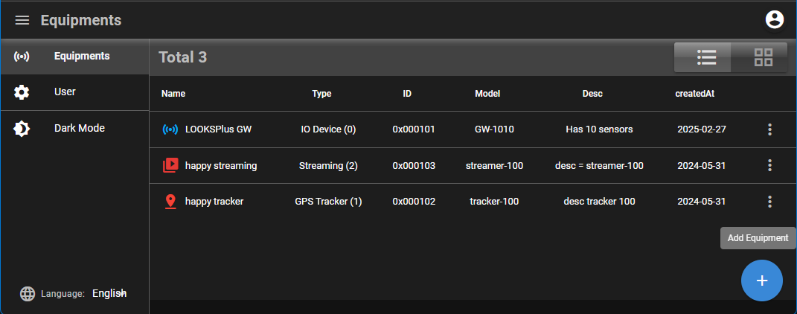
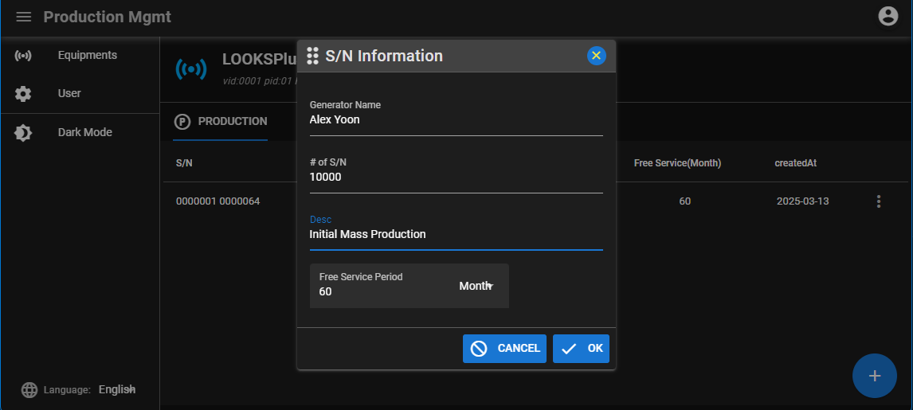
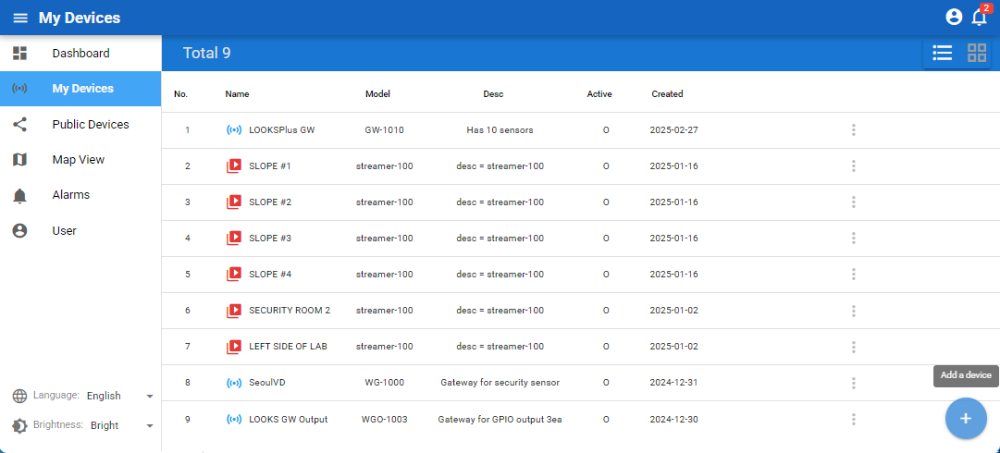
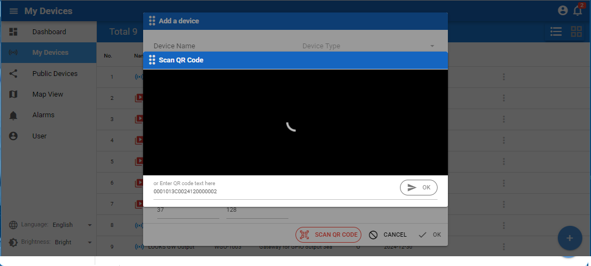

# NodeJS SDKs

This is a software development kit for device developers. It is a NodeJS sample code for developing devices that are integrated with the atcloud365.com platform. This sample demonstrates how to connect to the server and send data.

## Live Demo : https://atcloud365.com

## atCloud365.com Compositions


## Preparations

 Before using sdks, Developers are required to register, and upon logging in, they should define the device's attributes and generate device's "serial number" that are used in SDK or mass production.

- Signup as Manufacture (https://atcloud365.com/mfg)

## Examples

The README.md file provides instructions on how to use the source code for each individual example.

### Sensor example
  
- The sensor example illustrates how to connect to a server and transmit data.
- Upload only as one-wey communcation

### Actuator example

- The actuator example illustrates how to connect to a server and engage in two-way communication.

## Files on Example

- .env

  ```env
  SN="xxxxxxxxxxyyyyyyyyyy1"    # device serial number that is generated at 
  pubInterval= 5000             # data upload interval
  ```

- .env.dev

  ```env
  socketIo = `{
    "url":"https://atcloud365.com",   # socketIo server URL
    "path":"/api/dev/io"              # socketIo path 
  }`
  ```


## How to use SDK

1. Install dependency module
    ```sh
    yarn  # or npm install
    ```

2. Edit ".env" file for device-serial-number

    ```sh
    SN="xxxxxxxxxxyyyyyyyyyy1" # replace your device-serial-number
    pubInterval= 10000           # data upload interval
    ```

3. Run

    ```sh
    yarn atwindows    # run on windows at command prompt
    yarn atlinux      # run on linux at shell
    ```

## Defining device and its properties

- All developers define development products(as device) and their attributes at [atcloud365/mfg](https://atcloud365.com/mfg)
- Signup required

### Device Definition



### Device serial # Generations



## Testing at atcloud365

- Device can be tested at [atcloud365/mfg](https://atcloud365.com) using it's serian #
- Signup required

### Registering Device



